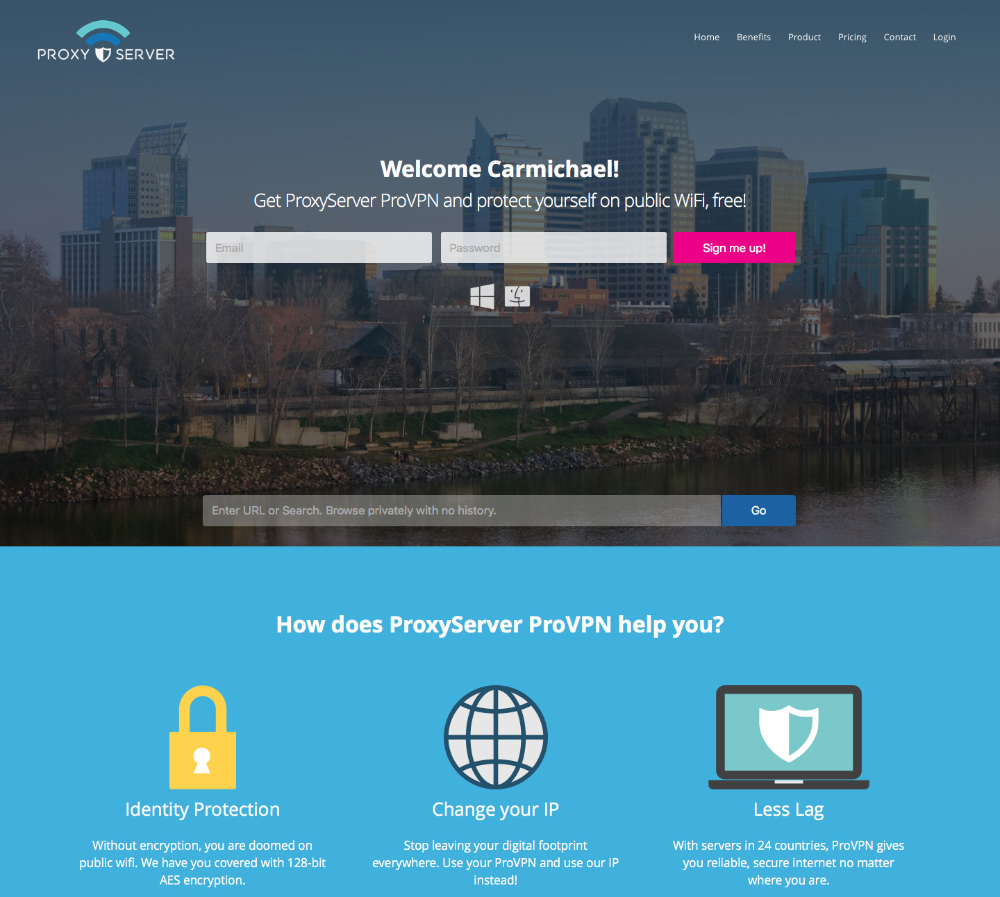
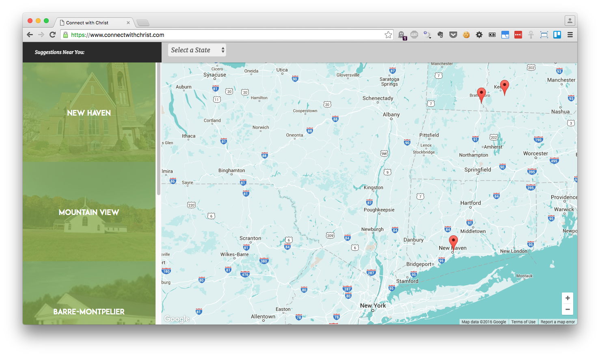
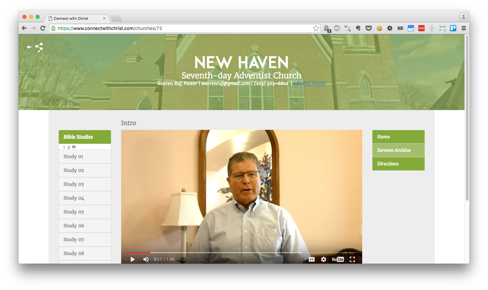
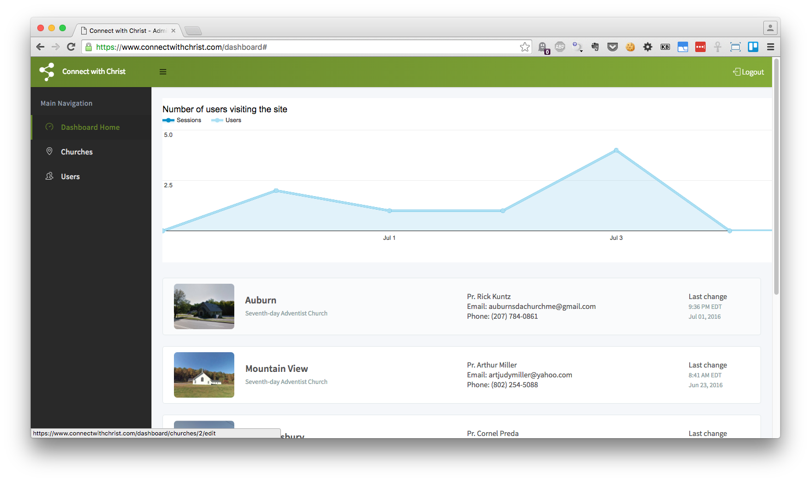
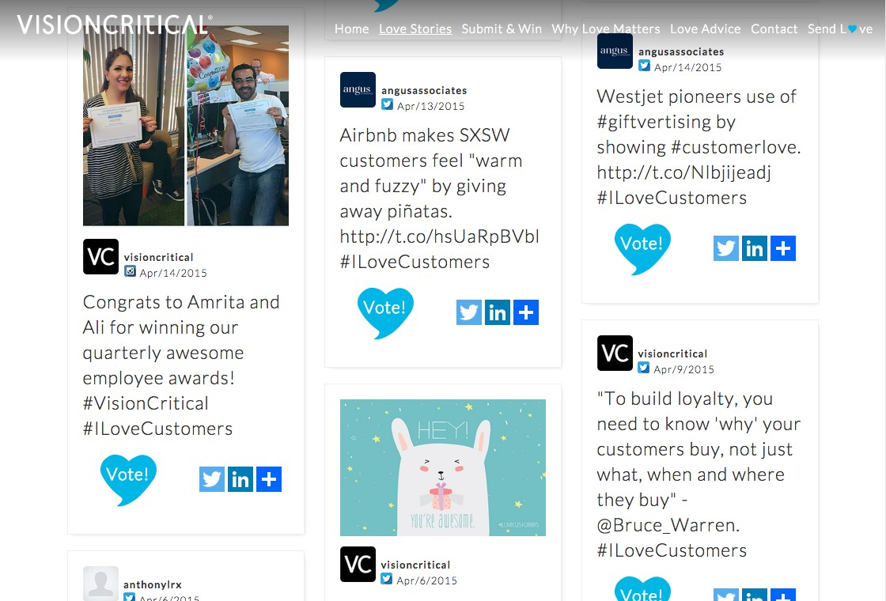
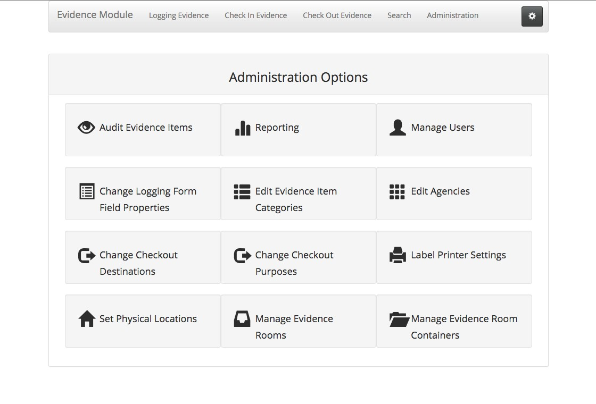
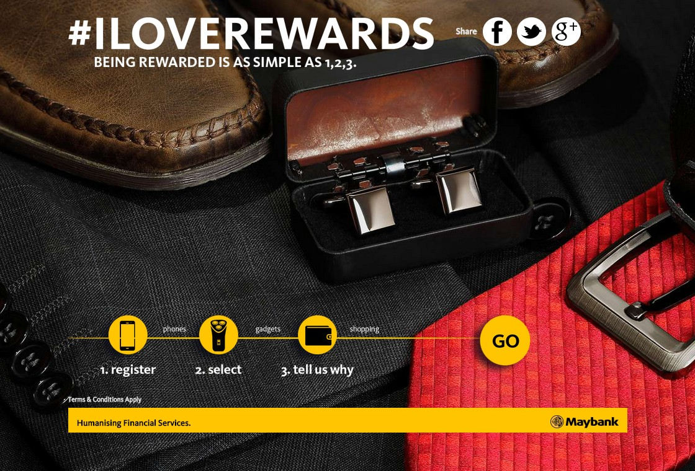

# ProxyServer.com

February 2016 | Web Development

My client brought me on to strategize creative ways to deliver difficult-to-proxy content. The client also put me on the PHP development team. Other responsibilities included front-end development, creating regular expression based content filters, and supporting a python library used in the project.

"Ben was great. He worked well with our existing team and brought a lot of good ideas and execution to the table. Will hire again when he has more time in his schedule."

Category      | Rating
--------------|-------
overall       | 4.7
skills        | 5.0
availability  | 4.0
communication | 5.0
quality       | 5.0
deadlines     | 4.0
cooperation   | 5.0

# GoalMinded.com

Web Development

My client needed support in developing the client and coach dashboards for this startup website. I assisted them in building out the dashboards and was responsible for the coach scheduling algorithms as we reproduced the functionality of Google Calendar.

Technologies: javascript, gruntjs, git, jquery, html5, bootstrap, php, symfony

"Ben has been an amazing find! He operates at the highest level of professionalism, is very responsive, communicates clearly and takes initiative to understand and complete complex tasks. Ben integrated seamlessly with our dev team and within a short time was accelerating the development of complex features for a startup product based on the Symfony II framework. It's been a pleasure working with Ben and we'll continue to work with him in the future. From myself and the team we highly recommend Ben's work. Thanks Ben!"

Overall Rating: 5.0

# Connect With Christ

My client needed a church directory site for a new outreach initiative to reach the communities local to each church. As part of this hyper-local effort, we developed a location-guided map page that directed the website visitor to a church page with media produced in their local church. Besides developing the front-end, we built a complete administrator dashboard to allow the management of church listings and their respective media.

# \#ILoveCustomers Campaign

Web Development

My client, Dog and Pony Studios, brought me onboard to engineer the social media integration for Vision Critical's B2B hashtag campaign micro-site. Part of the project included the need for a custom voting plugin, which I created to integrate nicely with our TwineSocial JS SDK implementation.

Technologies: user-experience-design, jquery, javascript, wordpress-plugin, wordpress, website-development, social-media-marketing

# Evidence Management System

Web Development

My client, a local District Attorney's office, needed a complete digital evidence management system for their crew of 19 investigators. I created a custom system from scratch that included barcode labeling (and printing), extensive administration customization, audits, and reports.

Technologies: website-development, web-programming, responsive-web-design, silex-framework, network-security, raspberry-pi, bootstrap, php

# Maybank Rewards Microsite

Web Development

My client redesigned two of the Maybank Rewards microsites and needed me to create CodeIgniter themes from PSD files within one day. I delivered a project that met and exceeded expectations while working with the client to deliver within budget and on schedule.

Technologies: website-development, responsive-web-design, css, css3, psd-to-html, codeigniter, object-oriented-php, php

